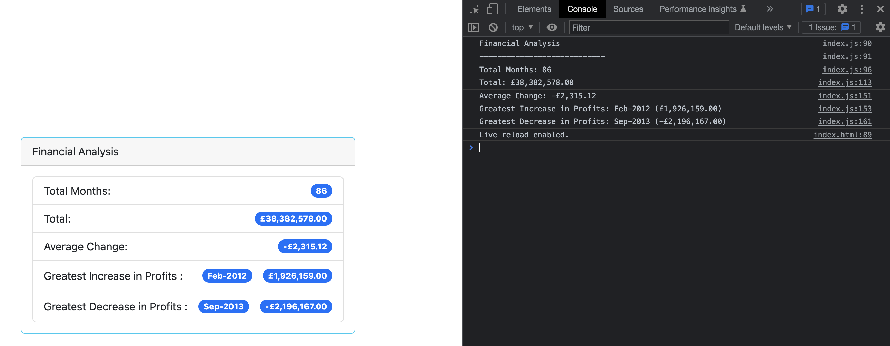

# Console-Finances
<!-- Improved compatibility of back to top link: See: https://github.com/othneildrew/Best-README-Template/pull/73 -->
<a name="readme-top"></a>

<!-- PROJECT SHIELDS -->
<!--
*** I'm using markdown "reference style" links for readability.
*** Reference links are enclosed in brackets [ ] instead of parentheses ( ).
*** See the bottom of this document for the declaration of the reference variables
*** for contributors-url, forks-url, etc. This is an optional, concise syntax you may use.
*** https://www.markdownguide.org/basic-syntax/#reference-style-links
-->
[![Contributors][contributors-shield]][contributors-url]
[![Forks][forks-shield]][forks-url]
[![Stargazers][stars-shield]][stars-url]
[![Issues][issues-shield]][issues-url]
[![MIT License][license-shield]][license-url]
[![LinkedIn][linkedin-shield]][linkedin-url]


<!-- PROJECT LOGO -->
<br />
<div align="center">
  <a href="https://github.com/fl4viooliveira/Console-Finances">
    
  </a>

<h3 align="center">Console Finances</h3>

  <p align="center">
    Unit 4 Challenge: Console Finances
    <br />
    <a href="https://github.com/fl4viooliveira/Console-Finances"><strong>Explore the docs »</strong></a>
    <br />
    <br />
    <a href="https://github.com/fl4viooliveira/Console-Finances">View Demo</a>
    ·
    <a href="https://github.com/fl4viooliveira/Console-Finances/issues">Report Bug</a>
    ·
    <a href="https://github.com/fl4viooliveira/Console-Finances/issues">Request Feature</a>
  </p>
</div>


<!-- TABLE OF CONTENTS -->
<details>
  <summary>Table of Contents</summary>
  <ol>
    <li>
      <a href="#about-the-project">About The Project</a>
      <ul>
        <li><a href="#built-with">Built With</a></li>
      </ul>
    </li>
    <li>
      <a href="#getting-started">Getting Started</a>
      <ul>
        <li><a href="#prerequisites">Prerequisites</a></li>
        <li><a href="#installation">Installation</a></li>
      </ul>
    </li>
    <li><a href="#contributing">Contributing</a></li>
    <li><a href="#license">License</a></li>
    <li><a href="#contact">Contact</a></li>
    <li><a href="#acknowledgments">Acknowledgments</a></li>
  </ol>
</details>


<!-- ABOUT THE PROJECT -->
## About The Project

[![Console Finances][product-screenshot]](https://fl4viooliveira.github.io/Console-Finances/)

## Overview

In this challenge, you'll be using the concepts you've learned to complete the required activity. This activity presents a real-world situation in which your newfound JavaScript skills will come in handy. You are tasked with creating code for analyzing the financial records of a company. 

## Instructions

1. Create a new GitHub repo called `Console-Finances`. Then, clone it to your computer.

2. Copy the starter files in your local git repository.
   
You have been given a dataset composed of arrays with two fields, Date and Profit/Losses.

Your task is to write JavaScript code that analyzes the records to calculate each of the following:

* The total number of months included in the dataset.

* The net total amount of Profit/Losses over the entire period.

* The average of the **changes** in Profit/Losses over the entire period.
  * You will need to track what the total change in profits are from month to month and then find the average.
  * (`Total/Number of months`)

* The greatest increase in profits (date and amount) over the entire period.

* The greatest decrease in losses (date and amount) over the entire period.

When you open your code in the browser your resulting analysis should look similar to the following:

<p align="right">(<a href="#readme-top">back to top</a>)</p>


### Built With

* [![Bootstrap][Bootstrap.com]][Bootstrap-url]
* [![HTML][HTML]][HTML-url]
* [![JavaScript][JavaScript]][JavaScript-url]

<p align="right">(<a href="#readme-top">back to top</a>)</p>


<!-- GETTING STARTED -->
## Getting Started

_To get a local copy up and running, follow these simple example steps._


### Prerequisites

* none

### Installation

_To install, on the terminal type:_
   ```sh
   git clone git@github.com:fl4viooliveira/Console-Finances.git
   ```
<p align="right">(<a href="#readme-top">back to top</a>)</p>


<!-- CONTRIBUTING -->
## Contributing

Contributions are what make the open source community such an amazing place to learn, inspire, and create. Any contributions you make are **greatly appreciated**.

If you have a suggestion that would make this better, please fork the repo and create a pull request. You can also simply open an issue with the tag "enhancement".
Don't forget to give the project a star! Thanks again!

1. Fork the Project
2. Create your Feature Branch (`git checkout -b feature/AmazingFeature`)
3. Commit your Changes (`git commit -m 'Add some AmazingFeature'`)
4. Push to the Branch (`git push origin feature/AmazingFeature`)
5. Open a Pull Request

<p align="right">(<a href="#readme-top">back to top</a>)</p>


<!-- LICENSE -->
## License

Distributed under the MIT License. See `LICENSE.txt` for more information.

<p align="right">(<a href="#readme-top">back to top</a>)</p>


<!-- CONTACT -->
## Contact

Flavio Oliveira - [@fl4viooliveira](https://twitter.com/fl4viooliveira) 

Project Link: [https://github.com/fl4viooliveira/Console-Finances](https://github.com/fl4viooliveira/Console-Finances)

<p align="right">(<a href="#readme-top">back to top</a>)</p>


<!-- ACKNOWLEDGMENTS -->
## Acknowledgments

* [Best-README-Template](https://github.com/othneildrew/Best-README-Template)

<p align="right">(<a href="#readme-top">back to top</a>)</p>


<!-- MARKDOWN LINKS & IMAGES -->
<!-- https://www.markdownguide.org/basic-syntax/#reference-style-links -->
[contributors-shield]: https://img.shields.io/github/contributors/fl4viooliveira/Console-Finances.svg?style=for-the-badge
[contributors-url]: https://github.com/fl4viooliveira/Console-Finances/graphs/contributors
[forks-shield]: https://img.shields.io/github/forks/fl4viooliveira/Console-Finances.svg?style=for-the-badge
[forks-url]: https://github.com/fl4viooliveira/Console-Finances/network/members
[stars-shield]: https://img.shields.io/github/stars/fl4viooliveira/Console-Finances.svg?style=for-the-badge
[stars-url]: https://github.com/fl4viooliveira/Console-Finances/stargazers
[issues-shield]: https://img.shields.io/github/issues/fl4viooliveira/Console-Finances.svg?style=for-the-badge
[issues-url]: https://github.com/fl4viooliveira/Console-Finances/issues
[license-shield]: https://img.shields.io/github/license/fl4viooliveira/Console-Finances.svg?style=for-the-badge
[license-url]: https://github.com/fl4viooliveira/Console-Finances/blob/master/LICENSE.txt
[linkedin-shield]: https://img.shields.io/badge/-LinkedIn-black.svg?style=for-the-badge&logo=linkedin&colorB=555
[linkedin-url]: https://linkedin.com/in/fl4viooliveira
[product-screenshot]: page.png
[Bootstrap.com]: https://img.shields.io/badge/Bootstrap-563D7C?style=for-the-badge&logo=bootstrap&logoColor=white
[Bootstrap-url]: https://getbootstrap.com

[HTML]: https://img.shields.io/badge/HTML-563D7C?style=for-the-badge&logo=html&logoColor=white
[HTML-url]: https://developer.mozilla.org/en-US/docs/Web/HTML/Element/html

[JavaScript]: https://img.shields.io/badge/JavaScript-563D7C?style=for-the-badge&logo=javascript&logoColor=white
[JavaScript-url]: https://developer.mozilla.org/en-US/docs/Web/JavaScript